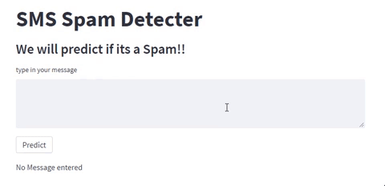
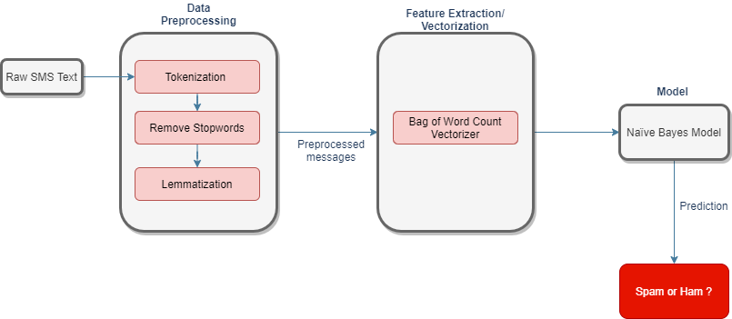

# SMS Spam Classifier 

This app detects if the sms is a Spam or ham(not a spam). To simulate the actual working of a spam sms detecter on the mobile devices, a text input bar is provided in the web app where user can type in the messeage and check if the message is spam or not.

[](https://share.streamlit.io/999harish999/sms-spam-classifier-streamlit/main/spam_app.py)

## Demo




## Motivation
In todays age of digital marketing, we get hunderds of sms messages on our phones, most of them are irrelevant to us ranging from claiming that 'you have won a million dollor,click the link below to claim the reward you won' to fake bank representative messages etc. Among those messages, the important ones gets lost and there is high chance that we miss to read them. Some of the messages can have links which can be really harmful, they can steal you personal information also.
It would be great if we have a tool which can identify these spam messages and save us from getting into lot of trouble. This project tends to solve the issue of identifying whether a message is spam or ham.

## Data
The SMS Spam Collection is a set of SMS tagged messages that have been collected for SMS Spam research. It contains one set of SMS messages in English of 5,574 messages, tagged acording being ham (legitimate) or spam.  

- A collection of 425 SMS spam messages was manually extracted from the Grumbletext Web site. This is a UK forum in which cell phone users make public claims about SMS spam messages, most of them without reporting the very spam message received. The identification of the text of spam messages in the claims is a very hard and time-consuming task, and it involved carefully scanning hundreds of web pages.   
- A subset of 3,375 SMS randomly chosen ham messages of the NUS SMS Corpus (NSC), which is a dataset of about 10,000 legitimate messages collected for research at the Department of Computer Science at the National University of Singapore. The messages largely originate from Singaporeans and mostly from students attending the University. These messages were collected from volunteers who were made aware that their contributions were going to be made publicly available.   


Data for this particular project is downloaded from kaggle.com   
Download link is provided bellow:  

[SMS Spam Collection Dataset](https://www.kaggle.com/uciml/sms-spam-collection-dataset)


## Data Exploration

Below is the ipython notebook where Exploratory data analysis is performed on the sms messages  
[EDA document](https://github.com/999harish999/SMS-Spam-Classifier-Streamlit/blob/main/SMS%20spam%20classifier%20Exploratory%20Data%20Analysis.ipynb)  


## System Design : Proposed Methodology



## Approach Design 
Complete Aproach of Model Building, Evaluation and Selection is available in bellow document  
[Approach ipython Notebook](https://github.com/999harish999/SMS-Spam-Classifier-Streamlit/blob/8d4ef36a78b6e366397018241db0b2647c2ca3c7/Approach%20document%20sms%20spam%20classifier.ipynb)


## Deployment 

The App is built using streamlit and deployed on https://share.streamlit.io/

## Requirements 

App was developed and deployed using bellow configuration 

```http
python 3.8.5
streamlit 0.89.0
nltk 3.5
scikit-learn 1.0
numpy 1.19.2
```

